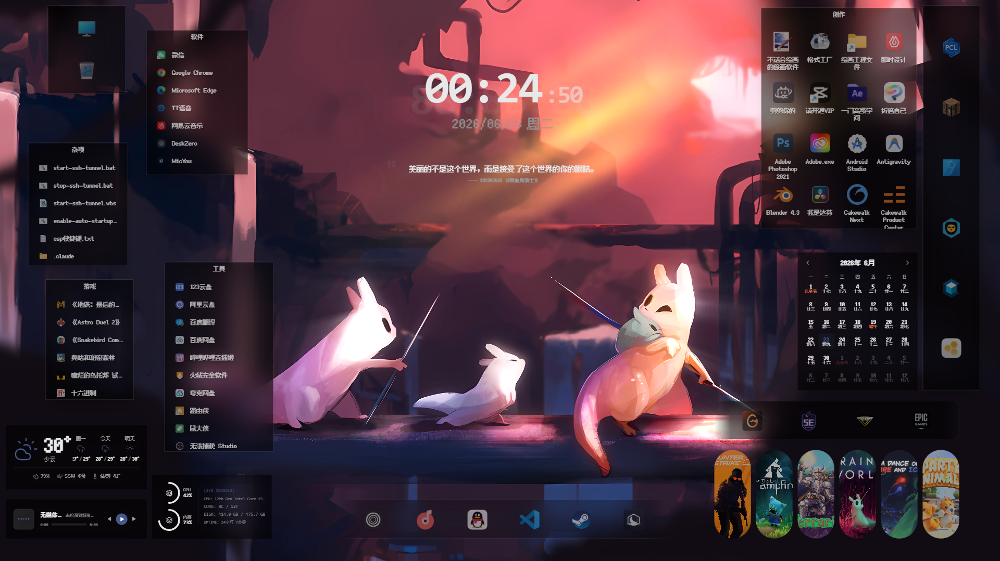

  <h1>DeskZero</h1>

  

   
   

  <a href="./README_zh.md">简体中文</a> | <b>English</b>

  <h6>Support Me</h6>

  

   
   

  Turn your Windows desktop into a fully customizable workspace.

  Built with Tauri v2 (Rust) + React, embedded into the Windows desktop icon layer.

## Features

- **New Desktop Experience** — Window embeds into the Windows desktop icon layer (between wallpaper and icons), seamlessly integrated with the native desktop
- **Desktop Containers** — Create customizable containers (similar to fences/groups) with support for normal, directory mapping, folder, game, and widget types
- **Directory Mapping** — Map containers to existing folders on disk with real-time file change synchronization
- **Desktop Widgets** — Clock, weather, todo list, calendar, countdown, music controls, sticky notes, system monitor, and more
- **Deep Customization** — Container colors, corner radius, layout, glassmorphism, parallax scrolling, icon glow, custom fonts
- **Global Font Settings** — Built-in Noto Sans SC, LXGW WenKai, and Fusion Pixel Font; supports loading local system fonts
- **Desktop File Management** — Drag & drop, marquee selection, context menus, clipboard operations, batch sorting
- **Auto Backup** — Automatic background backup of desktop layouts with manual snapshots and one-click restore
- **Multi-Monitor Support** — Automatic multi-monitor detection with DPI scaling adaptation
- **High Performance** — Rust backend + React frontend with minimal system resource usage
- **Clean Storage** — All configurations stored safely in an embedded SQLite database, no extra files on disk

## Screenshots

  

## Getting Started

DeskZero is currently available for **Windows only**.

Download the latest release from [GitHub Releases](https://github.com/LanRhyme/DeskZero/releases):

| Variant | File | Description |
|:---:|:---:|:---:|
| Installer | `DeskZero_x.x.x_x64-setup.exe` | Standard installation |
| Portable | `DeskZero_x.x.x_x64-portable.exe` | No installation required |

## Usage

- **Launch** — DeskZero runs in the background with its main window attached to the desktop icon layer
- **Create a Container** — Right-click on an empty desktop space and select create container
- **Add Items** — Drag and drop shortcuts or files into containers
- **Add Widgets** — Right-click desktop → New Widget, then choose a widget type
- **Settings** — Right-click the system tray icon → Settings to customize grid, fonts, themes, glassmorphism, and more
- **Hide/Show Icons** — Double-click on an empty desktop space to toggle desktop icon visibility

## Tech Stack

| Layer | Technology |
|:---:|:---:|
| Frontend | React 19 + TypeScript + Tailwind CSS v4 + Zustand + Framer Motion |
| Backend | Rust + Tauri v2 + rusqlite + tokio |
| Storage | SQLite (bundled) |
| Build | Vite + cargo |

## License

[GPL-3.0 License](https://opensource.org/licenses/GPL-3.0)
